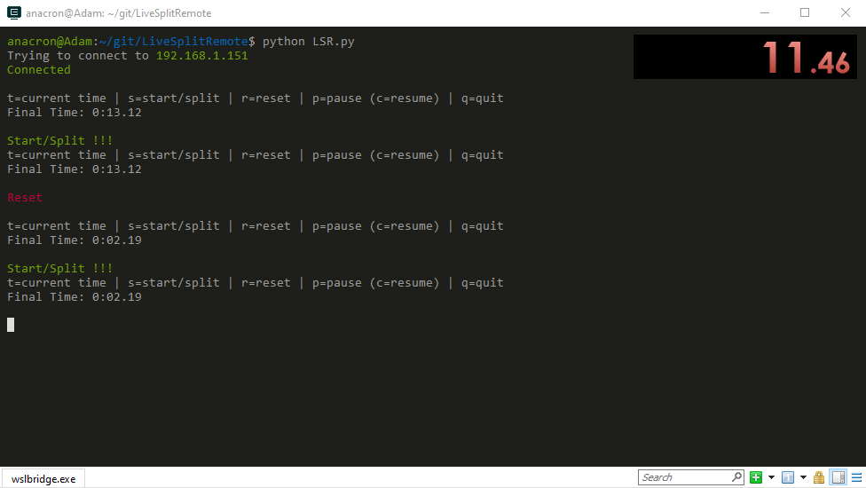
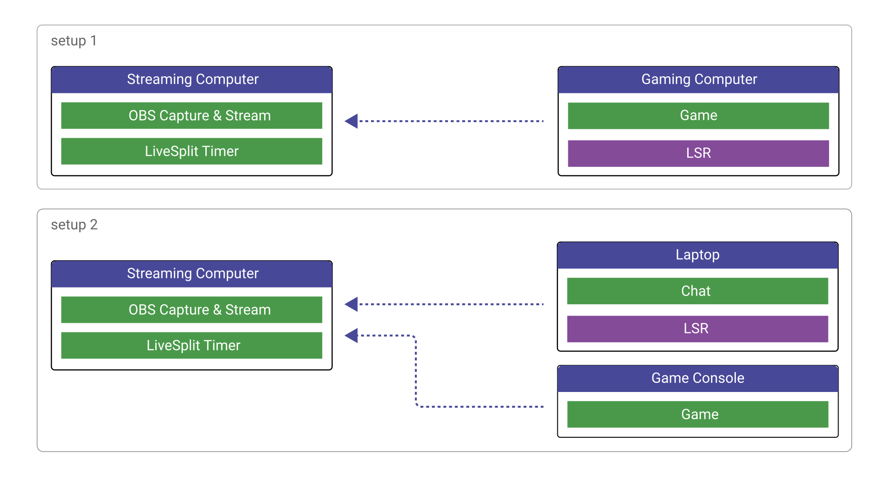

# LiveSplitRemote
Python remote with key inputs for LiveSplit server


## What is it for

[LiveSplit](https://livesplit.org) is a timer made for speedrunners.
This remote is made for [LiveSplit Server](https://github.com/LiveSplit/LiveSplit.Server) component to control the timer on the same network using key inputs in a terminal window.


### Example setups


You should have setup of at least two computers to benefit from a remote in the first place.
Computer 1 is used for streaming and running the LiveSplit timer;
Computer 2 is either the one you have next to your gaming setup as a remote & chat, or you are using it directly to play.

### Prerequisites
You need to have LiveSplit installed & configured with LiveSplit server before using this.
Download [LiveSplit](https://livesplit.org) from their website and get the [LiveSplit Server](https://github.com/LiveSplit/LiveSplit.Server) from their git repo.

click library for python is not installed by default.
You can install it via pip (as a root)
```
pip install click
```

### Installing
change the address & port as needed editing the LSR.py file

default is ```ip = "192.168.1.151"```
default port is ```16834```

To run you can use:
```
python LSR.py
```
